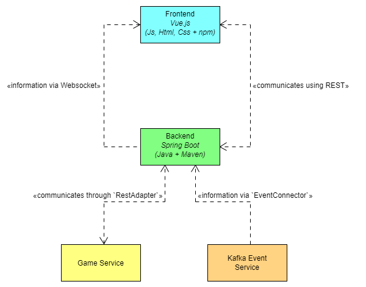
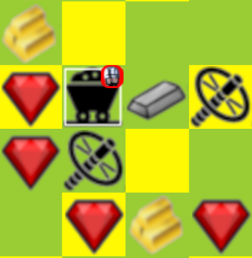

# Robocop Player for _The Microservice Dungeon_


## Authors

| Name             | Github          |
|------------------|-----------------|
| Jannik Alexander | @InstantRegrets |
| Oliver Wichmann  | @OliverW21      |
| Thomas Raser     | @ThmsRa         |

## Access
Access Robocop on [cides03.gm.fh-koeln.de:8103](http://cides03.gm.fh-koeln.de:8103) if you dare...

<details>
  <summary>Hint</summary>

  ```
  To access Robocop you must ask nicely.
  ```

   - <details>
     <summary>Another Hint</summary>

      ```
     Tell him 'letMePlay'
      ```
   
   </details>

</details>

## Installation

1. Import `player-robocop` Maven Package
2. Let Intellij figure out everything and install the packages
3. Choose `RunAll` run configuration. This will start spring and the Vue frontend

- frontend will be available on [http://localhost:8103/](http://localhost:8103/#/)
- All other routes will be passed to Spring

### Database Inspection

To setup an IntelliJ database connection:

1. Select H2 as Datasource
2. Choose "Remote" as the connection type
3. Set user to robocop and password to password
4. modify the connection URL to look like this:
   `jdbc:h2:<ABSOLUTE/PATH/TO/DB-FILE>;AUTO_SERVER=TRUE`
5. Connect + Refresh
6. ???
7. Profit

## Architecture

The rough system structure of this package looks like this:



## Information

### Strategy

Walk around aimlessly

### Map

Map is internally represented by two Arrays. One with planets and one with robots. Each Array has a length defined by
the map size. Each index in these arrays represents one position on the map like this:

```
  1   2   3   4
  5   6   7   8
  9   10  11  12
  13  14  15  16
```

The corresponding Array to represent this map looks like this:

```
[1,2,3,4,5,6,7,8,9,10,11,12,13,14,15,16]
```

The Size of the array is calculated with `(mapSize * 2)^2`.
`mapSize` depends on the player count and is either 15, 20 or 35.

To represent this map in the frontend it gets parsed into a 2 dimensional array with 3 "layers". Each layer represents
one type of "tile". The tiles look like this and each one represents a characteristic of the current position:


- tiles 1, 2, 3 represent "Gravity" or "Movement Difficulty"
- tiles 4, 5, 6, 7, 8, 9 represent "space station", "coal", "iron", "ruby", "gold" and "platin"
- tile 10 marks a known planet position where we don't know the movement difficulty
- tile 11 is a marker for the current robot

The layers each contain a set of these indexes.

- layer[0] = -1, 1, 2, 3, 10 -> Gravity Layer
- layer[1] = -1, 4, 5, 6, 7, 8, 9 -> Type Layer
- layer[2] = -1, 11 -> Robot Layer

`-1` means "not relevant for this layer". I.e. "the corresponding square was not explored" (all layers),
"the planet hat no space station or resources" (type layer), "there is no robot on this tile" (robot layer)

In the frontend these layers get rendered on top of each other to build an interactive, scrollable map visualization of
explored planets. First the gravity layer, then the type layer and last the robot layer.
A map that looks like this:



was build using these 3 layers:
- Gravity layer: [ 1,  2,  1,  1,  2,  1,  1,  2,  1,  1,  2,  1,  1,  2,  1,  1]
- Type layer:    [ 8, -1, -1, -1,  7,  5,  6,  4,  7,  4, -1, -1, -1,  7,  8,  7]
- Robot Layer:   [-1, -1, -1, -1, -1, 11, -1, -1, -1, -1, -1, -1, -1, -1, -1, -1]
