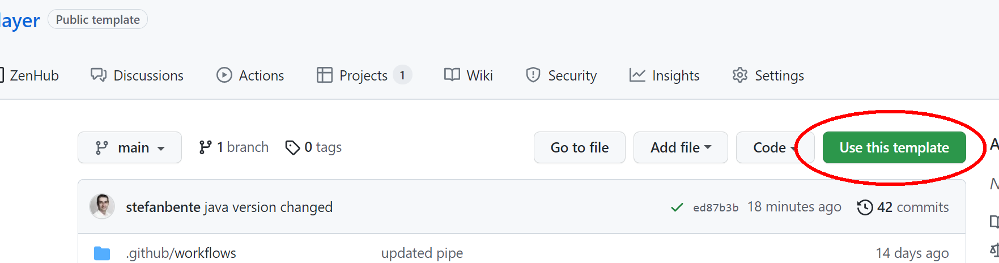
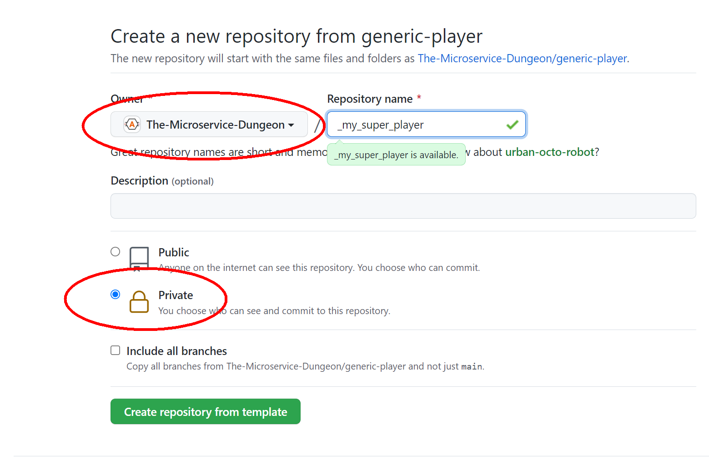
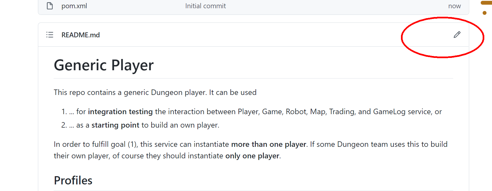
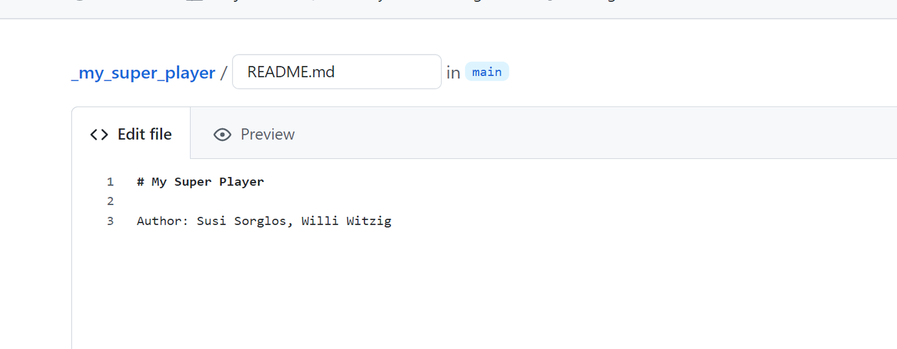
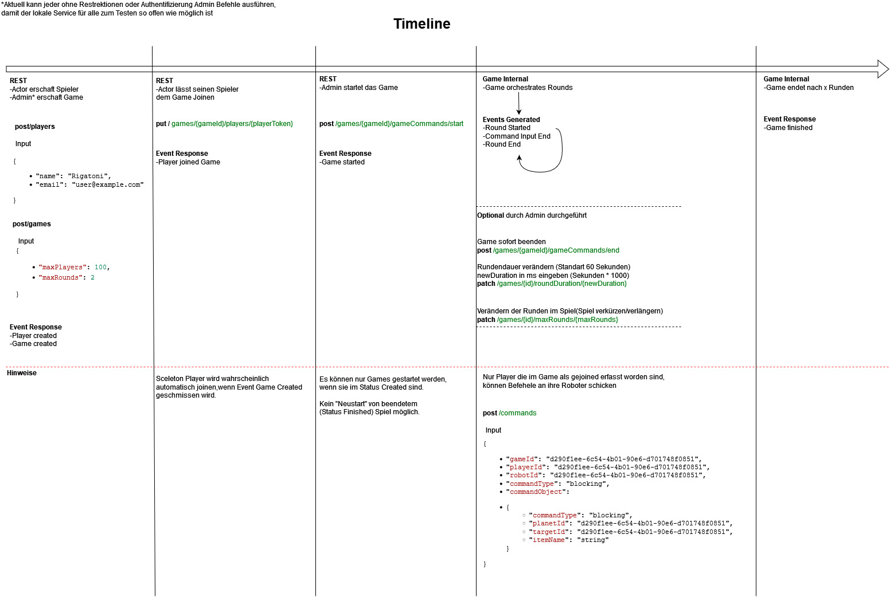

# Generic Player template for _The Microservice Dungeon_

This repo contains a generic, Java-based Dungeon player template. It can be used to build an own player based on it. 

**What it has:**

- Some basic domain model (see below)
- Some REST call implementations from player to Game service (caveat: unit-tested, but not yet integration-tested)
- Some basic event listeners
- Player registration, and some logic to listen to a game creation and start

**What it doesn't have:**

- Basically anything else. The robots don't have attributes, they don't do anything. There is no money yet. Planets
  are just UUIDs. 
- This means: All the rest is yours to implement. 

**Will it be developed any further?**

No. We will "iron out the kinks", meaning: We will make sure that the REST calls implemented here, and the listeners, 
work properly with the rest of all services. On top of that, no further features will be added.

## How to use it

### In `https://github.com/The-Microservice-Dungeon/generic-player`, click "Use this template"

### Enter your repo's name. Three things are important:

1. The repo name must start with "_" (underscore)
2. The repo must be created in the organization, **NOT in your own Github account**.
3. Make the repo private.

### Edit the README ...

### ... and replace it with your own documentation. Important: Add your team names as authors!

## How can I merge later changes to the template into my own repo?

The way to do this is described [here](https://stackoverflow.com/questions/56577184/github-pull-changes-from-a-template-repository). In short:
* Follow the steps above to create your own repo based on the template
* Go to the repo
* `git remote add template https://github.com/The-Microservice-Dungeon/generic-player.git`
* `git fetch --all`
* `git merge template/main --allow-unrelated-histories`

## Architecture 

The domain model is as such:

The packages are designed around the aggregates, according the basic DDD approach to software architecture. 
This leads to the following internal package dependency structure (without event and REST adapters):

Connection to the Apache Kafka is abstracted through the `eventconnector` package, connection to Game service (via REST)
through the `restadapter` package. (For internal package dependency see above - not depicted here for more clarity.)

## What do I need to do to create my own player based on this?

The Game team has created a great "cheat sheet" which I take the liberty to reproduce here. It gives a good impression
of the necessary steps. 

