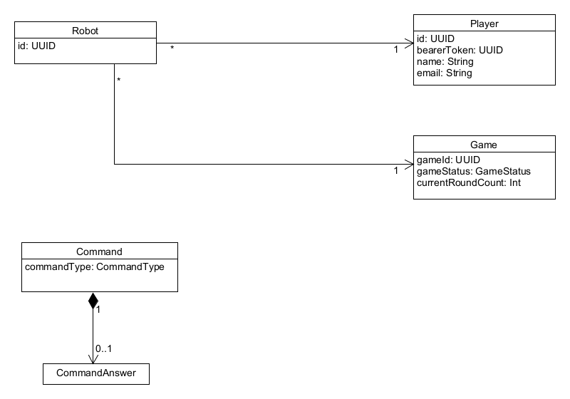
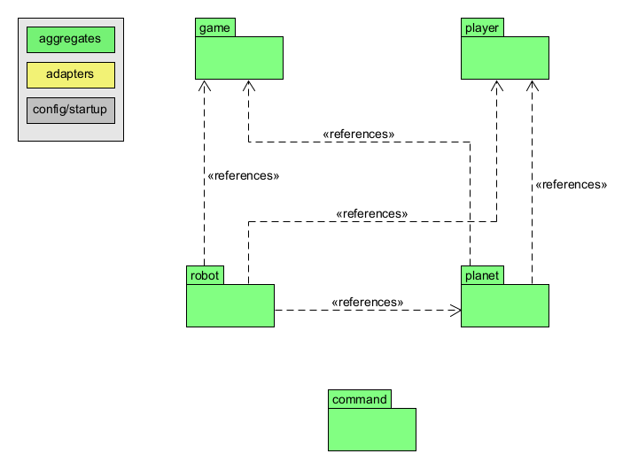
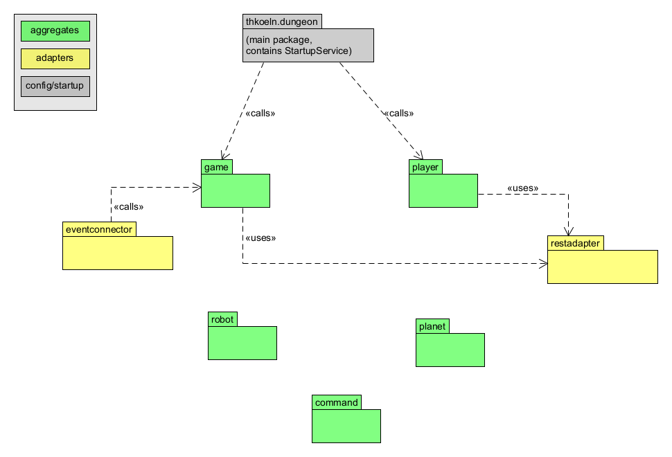

# Generic Player

This repo contains a generic Dungeon player. It can be used  
1. ... for **integration testing** the interaction between Player, Game, Robot, Map, Trading, and GameLog service, or 
2. ... as a **starting point** to build an own player.

In order to fulfill goal (1), this service can instantiate **more than one player**. If some Dungeon team uses this
to build their own player, of course they should instantiate **only one player**. 

## Profiles 

The service maintains two Spring profiles, in order to serve the above goals: 
1. **mock** - used for unit-testing the basic player logic. No Kafka, no REST calls. All event listeners and REST 
   calls are fully mocked with random data.
2. **prod** - assumes a running Kafka and an available endpoint for the Game service (either as local Docker 
   containers, or in production environment; the URLs and ports are controlled via environment variables).
   If used locally, all dungeon services need to be locally running using the [Python script](https://github.com/The-Microservice-Dungeon/local-dev-environment), 
   plus a local Kafka (either [manually](https://kafka.apache.org/quickstart), or with this [Compose script](https://github.com/The-Microservice-Dungeon/devops/tree/kafka)).

(FIXME - mock & prod are outdated)

# Architecture

The domain model is as such:

The packages are designed around the aggregates, according the basic DDD approach to software architecture. 
This leads to the following internal package dependency structure (without event and REST adapters):

Connection to the Apache Kafka is abstracted through the `eventconnector` package, connection to Game service (via REST)
through the `restadapter` package. (For internal package dependency see above - not depicted here for more clarity.)

# Player Strategy 

tbd

## At startup

At startup, the service instantiates one or several players, depending on the chosen profile. 

## Some basic strategy

tbd
